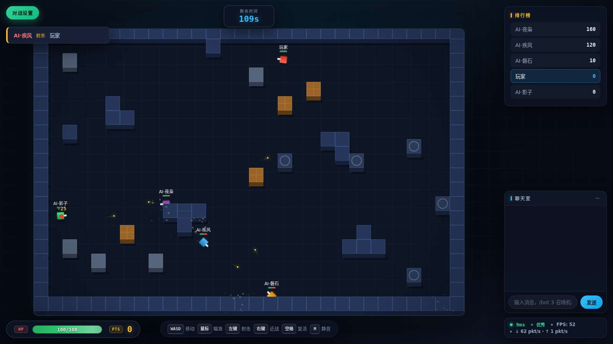
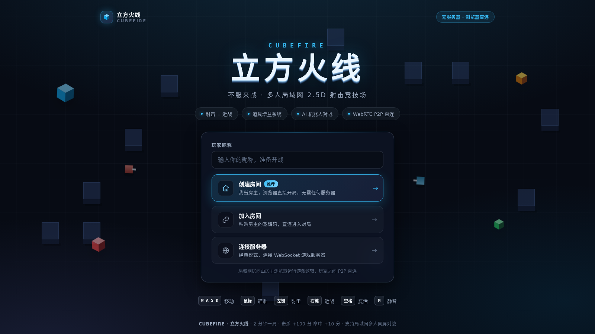
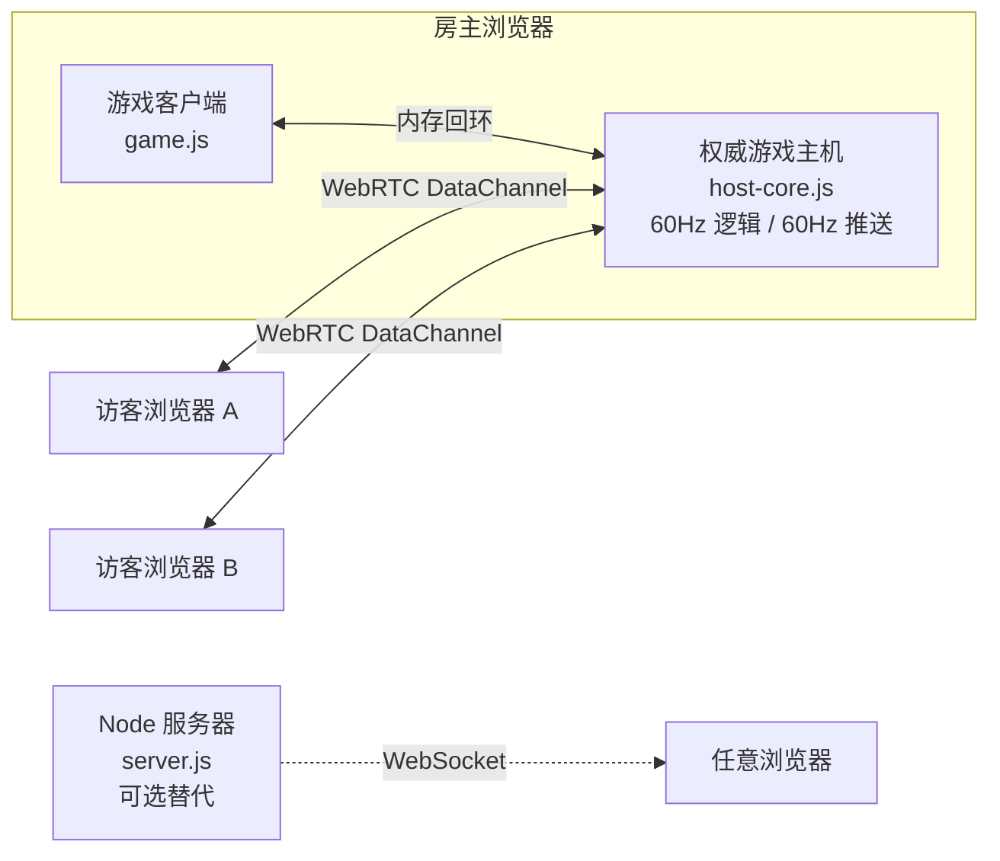

<div align="center">

# CUBEFIRE · 立方火线

**不服来战 —— 多人局域网 2.5D 射击竞技场**

无需服务器 · 浏览器 P2P 直连 · AI 机器人对战 · 全套合成音效

[](LICENSE)




</div>

---

## 这是什么

CUBEFIRE 是一款俯视角 2.5D 多人射击游戏。它最特别的地方是**不需要任何服务器**：
房主的浏览器直接运行权威游戏逻辑，其他玩家通过 WebRTC DataChannel 与房主 P2P 直连。
把 `index.html` 拷给朋友（U 盘、网盘、聊天工具都行）或放上任意静态托管，双击打开就能开战。

- **两分钟一局**：射击 +10 分/次命中，击杀 +100 分，结算排行自动开启下一局
- **射击 + 近战**：左键开枪，右键一刀秒杀（1 秒冷却，50 像素范围）
- **道具系统**：护盾（减伤 50%）/ 疾速射击 / 伤害提升 / 回血，15 秒时效
- **AI 机器人**：最多 8 个，会巡逻、捡道具、卡视线、走位对枪
- **游戏手感**：屏幕震动、伤害飘字、击杀闪光、曳光弹、Web Audio 实时合成音效
- **2.5D 渲染**：墙体立体挤出、画家算法前后遮挡、动态阴影、暗角

<div align="center">



</div>

## 快速开始

### 方式一：无服务器模式（推荐）

不需要安装任何东西：

1. **房主**：浏览器打开 `index.html` → 输入昵称 → 「创建房间」，直接进入游戏
2. **邀请**：点左上角「对战设置」→「生成邀请码」→ 发给朋友（微信 / QQ 均可）
3. **加入**：朋友打开同一个 `index.html` → 「加入房间」→ 粘贴邀请码 → 「生成应答码」发回房主
4. **确认**：房主粘贴应答码 → 「确认连接」，对方自动进入游戏

每邀请一位新玩家重复 2–4（一人一份邀请码）。想打人机就在「对战设置」里加机器人，
或在聊天框输入 `/bot 3`。

### 方式二：WebSocket 服务器模式

适合公网对战或不方便交换邀请码的场景：

```bash
npm install
npm start          # 生产模式
npm run dev        # 开发模式（nodemon 自动重启）
```

浏览器访问 `http://<服务器IP>:38080`，输入昵称后选「连接服务器」。

## 操作

| 按键 | 动作 |
|------|------|
| `W A S D` / 方向键 | 移动 |
| 鼠标 | 瞄准 |
| 左键 | 射击（200ms 冷却） |
| 右键 | 近战（一刀秒杀，1s 冷却） |
| 空格 | 死亡后复活 |
| `M` | 静音 / 取消静音 |
| 聊天输入 `/bot N` | 设置 AI 机器人数量（0–8） |

## 联机原理



- **信令零依赖**：邀请码 / 应答码就是 Base64 编码的 WebRTC SDP，靠人手动传递，
  因此不需要信令服务器；局域网直连也不需要 STUN / TURN
- **权威主机**：所有判定（移动碰撞、弹道、伤害、道具、机器人）都在房主端进行，
  客户端只做渲染、输入和预测
- **同步策略**：自定义二进制协议 + 增量状态同步（60Hz），客户端做本地预测、
  死区纠偏和插值外推，1 像素位置精度

## 项目结构

| 文件 | 职责 |
|------|------|
| `index.html` | 页面、着陆大厅、HUD、全部样式 |
| `game.js` | 客户端：渲染（2.5D 管线）、输入、预测插值、特效 |
| `host-core.js` | 浏览器端权威游戏主机（无服务器模式），含 AI 机器人 |
| `lan.js` | WebRTC 手动信令、传输层封装、大厅交互、首页动效 |
| `sound.js` | Web Audio 实时合成音效（无外部资源） |
| `server.js` | Node WebSocket 服务器（可选的经典模式），逻辑与 host-core 一致 |

## 自定义配置

游戏参数集中在 `GAME_CONFIG`（`host-core.js` 与 `server.js` 各一份，保持一致即可）：

```javascript
const GAME_CONFIG = {
    CANVAS_WIDTH: 1200,        // 战场宽度
    CANVAS_HEIGHT: 800,        // 战场高度
    PLAYER_SIZE: 20,           // 玩家尺寸
    PLAYER_SPEED: 5,           // 移动速度（像素/逻辑帧）
    BULLET_SPEED: 10,          // 子弹速度（像素/逻辑帧）
    MAX_HEALTH: 100,           // 生命值
    RESPAWN_TIME: 3000,        // 复活时间 (ms)
    POWERUP_SPAWN_INTERVAL: 20000,  // 道具刷新间隔 (ms)
    POWERUP_DURATION: 15000,   // 道具持续时间 (ms)
    MELEE_RANGE: 50,           // 近战范围
    MELEE_COOLDOWN: 1000       // 近战冷却 (ms)
};
```

机器人难度在 `host-core.js` 的机器人段落调整：`aimErr`（散布系数）、
`nextShot`（射击间隔）、索敌距离（默认 520px）。

## 常见问题

| 问题 | 处理 |
|------|------|
| 应答码确认后连不上 | 确认双方在同一局域网、路由器未开 AP 隔离；邀请码一次性有效，重新生成后旧码作废 |
| 没有声音 | 浏览器要求先与页面交互，点一下页面即可；`M` 键检查是否静音 |
| 服务器模式连不上 | 确认 `npm start` 正在运行、端口 38080 未被占用 |
| 房主关页面后游戏结束 | 设计如此——权威逻辑跑在房主浏览器里，请换人重新建房 |

## License

[MIT](LICENSE)
