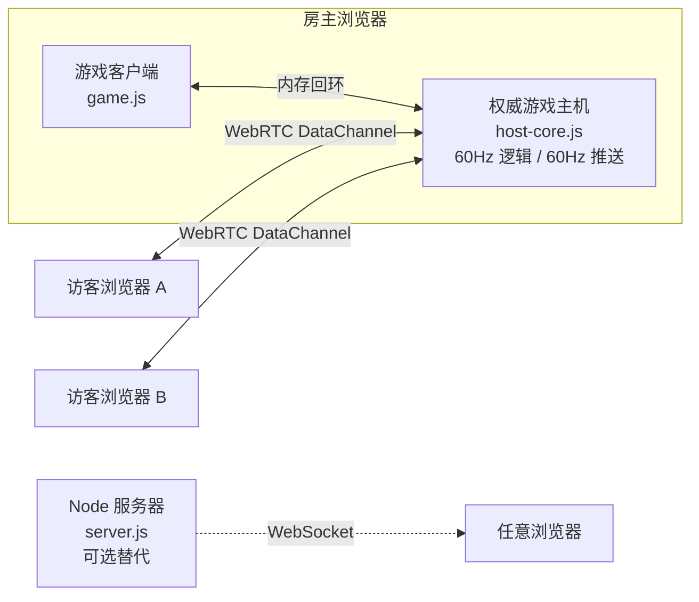

<div align="center">

# CUBEFIRE · 立方火线

**不服来战 —— 多人局域网 2.5D 射击竞技场**

无需服务器 · 浏览器 P2P 直连 · AI 机器人对战 · 全套合成音效

[](LICENSE)


</div>

---

## 这是什么

CUBEFIRE 是一款俯视角 2.5D 多人射击游戏。它最特别的地方是**不需要任何服务器**：
房主的浏览器直接运行权威游戏逻辑，其他玩家通过 WebRTC DataChannel 与房主 P2P 直连。
把 `index.html` 拷给朋友（U 盘、网盘、聊天工具都行）或放上任意静态托管，双击打开就能开战。

- **两分钟一局**：射击 +10 分/次命中，击杀 +100 分，结算排行自动开启下一局
- **射击 + 近战**：左键开枪，右键一刀秒杀（1 秒冷却，50 像素范围）
- **道具系统**：护盾（减伤 50%）/ 疾速射击 / 伤害提升 / 回血，15 秒时效
- **AI 机器人**：最多 8 个，会巡逻、捡道具、卡视线、走位对枪
- **游戏手感**：屏幕震动、伤害飘字、击杀闪光、曳光弹、Web Audio 实时合成音效
- **2.5D 渲染**：墙体立体挤出、画家算法前后遮挡、动态阴影、暗角

<div align="center">


</div>

## 快速开始

### 方式一：无服务器模式（推荐）

不需要安装任何东西：

1. **最快方式**：输入昵称 → 「快速开战」，自动加入人最多的公开房间，
   没有房间就自动开新房并带上 3 个机器人
2. **房主**：「创建房间」，浏览器直接开局；**加入**：「加入房间」→ 从房间列表
   点一下加入，或输入房主的 **6 位房间码**；加入过的房间记在「最近」一键重连
3. **手机可玩**：触屏设备自动启用虚拟摇杆（左半屏移动）+ 按住右半屏瞄准开火 +
   近战/手雷/换弹按钮，建议横屏

说明：

- 公开房间自动出现在房间列表（创建时可选「私密 · 仅凭码」不上列表）
- 同一浏览器每次开房用同一个房间码（持久化），朋友存过一次就能一直用
- 房间列表由玩家浏览器竞选出的"目录节点"维护，无需任何服务器；
  目录页面关闭后下一个访问者自动补位，房主心跳注册几秒内自愈
- 房间码/列表依赖公共信令云（PeerJS）自动完成 WebRTC 握手，仅握手瞬间联网，
  游戏数据始终 P2P 直连。**纯离线局域网**（无互联网）时点「使用手动邀请码连接」，
  按邀请码 → 应答码 → 确认三步人肉传码即可，完全不需要网络服务

想打人机就在「对战设置」里加机器人，或在聊天框输入 `/bot 3`。

### 方式二：WebSocket 服务器模式

适合公网对战或不方便交换邀请码的场景：

```bash
npm install
npm start          # 生产模式
npm run dev        # 开发模式（nodemon 自动重启）
```

浏览器访问 `http://<服务器IP>:38080`，输入昵称后选「连接服务器」。

### 方式三：部署到 Vercel（公网分发）

无服务器 P2P 模式是纯静态页面，可以直接托管到 Vercel：

```bash
npm i -g vercel
vercel --prod        # 在项目根目录执行，按提示登录即可
```

或者在 [vercel.com](https://vercel.com) 上「Add New Project」导入本仓库，
无需任何构建配置（`vercel.json` 已就绪），部署完成即可分享链接开黑。

说明：

- Vercel 只负责分发页面，游戏逻辑依然跑在房主浏览器里，联机流程与本地打开完全一样
- 「连接服务器」入口在静态托管下会自动隐藏（Vercel 不支持常驻 WebSocket 服务）
- 已内置公共 STUN 服务器，跨网络的玩家也能交换邀请码直连；
  少数严格对称 NAT 环境下 P2P 打洞可能失败，此时请改用同一局域网或服务器模式

## 操作

| 按键 | 动作 |
|------|------|
| `W A S D` / 方向键 | 移动 |
| 鼠标 | 瞄准 |
| 左键（可按住连发） | 射击，射速随武器 |
| 右键 | 近战（一刀秒杀，1s 冷却） |
| `R` | 换弹夹 |
| `G` | 投掷手雷（朝准星，最远 320px，落地约 1 秒后爆炸） |
| 空格 | 死亡后复活 |
| `M` | 静音 / 取消静音 |
| 聊天输入 `/bot N` | 设置 AI 机器人数量（0–8） |
| 聊天输入 `/weapon 武器ID` | 立即换枪（rifle/smg/shotgun/sniper） |

## 武器与道具箱

默认武器为**步枪**（备弹无限）；地图每 12 秒刷出一个**道具箱**（最多 5 个，
内容未知，走上去开箱揭示）：45% 概率开出武器，55% 概率开出增益。

| 武器 | 伤害 | 射速 | 弹夹/备弹 | 特点 |
|------|------|------|-----------|------|
| 步枪 | 25 | 200ms | 30 / ∞ | 默认，均衡 |
| 冲锋枪 | 12 | 90ms | 40 / 80 | 高射速压制，轻微散布 |
| 霰弹枪 | 11×6 | 750ms | 6 / 24 | 一次 6 弹丸扇形，近距离爆发，射程短 |
| 狙击枪 | 100 | 1100ms | 5 / 10 | 无护盾满血一枪带走 |
| 火箭筒 | 85(中心) | 1500ms | 1 / 4 | 火箭命中/撞墙爆炸，90px 范围伤害衰减 |

**手雷**：每条命携带 2 颗（上限 4），`G` 键朝准星投掷，落地引信约 1 秒后爆炸，
100px 范围伤害衰减（中心 75）；爆炸不伤及投掷者与队友。

**可破坏掩体**：木箱可被爆炸炸毁；油桶被子弹或爆炸引爆产生连锁爆炸
（连锁击杀计入触发者战绩），下一局地形自动恢复。

**机甲空投**：武装直升机每约 50 秒空投一台机甲（聊天输入 `/mech` 立即召唤），
走近即可驾驶：无限弹药加特林（左键）+ 无限火箭（G 键，1.6s 冷却），
400 点装甲、2 倍受弹体型；装甲打空机甲殉爆（波及四周，驾驶员弹出）。

打空弹夹自动换弹；特殊武器备弹耗尽自动换回步枪；死亡复活重置为步枪。
增益箱内容：护盾（减伤50%）、急速射击（射速翻倍）、伤害强化（+50%）、
满血恢复、手雷补给（+2）。

## 联机原理



- **双信令通道**：默认房间码模式借助 PeerJS 公共信令云自动交换 SDP（仅握手时联网）；
  离线后备的邀请码 / 应答码就是 Base64 编码的 WebRTC SDP，靠人手动传递，
  完全不需要信令服务器；局域网直连也不需要 STUN / TURN
- **权威主机**：所有判定（移动碰撞、弹道、伤害、道具、机器人）都在房主端进行，
  客户端只做渲染、输入和预测
- **同步策略**：自定义二进制协议 + 增量状态同步（60Hz），客户端做本地预测、
  死区纠偏和插值外推，1 像素位置精度

## 项目结构

| 文件 | 职责 |
|------|------|
| `index.html` | 页面、着陆大厅、HUD、全部样式 |
| `game.js` | 客户端：渲染（2.5D 管线）、输入、预测插值、特效 |
| `host-core.js` | 浏览器端权威游戏主机（无服务器模式），含 AI 机器人 |
| `lan.js` | 房间码信令（PeerJS）、选举制房间列表目录、WebRTC 手动信令、传输层封装、大厅交互、首页动效 |
| `sound.js` | Web Audio 实时合成音效（无外部资源） |
| `server.js` | Node WebSocket 服务器（可选的经典模式），逻辑与 host-core 一致 |

## 自定义配置

游戏参数集中在 `GAME_CONFIG`（`host-core.js` 与 `server.js` 各一份，保持一致即可）：

```javascript
const GAME_CONFIG = {
    CANVAS_WIDTH: 1200,        // 战场宽度
    CANVAS_HEIGHT: 800,        // 战场高度
    PLAYER_SIZE: 20,           // 玩家尺寸
    PLAYER_SPEED: 5,           // 移动速度（像素/逻辑帧）
    BULLET_SPEED: 10,          // 子弹速度（像素/逻辑帧）
    MAX_HEALTH: 100,           // 生命值
    RESPAWN_TIME: 3000,        // 复活时间 (ms)
    POWERUP_SPAWN_INTERVAL: 20000,  // 道具刷新间隔 (ms)
    POWERUP_DURATION: 15000,   // 道具持续时间 (ms)
    MELEE_RANGE: 50,           // 近战范围
    MELEE_COOLDOWN: 1000       // 近战冷却 (ms)
};
```

机器人难度在 `host-core.js` 的机器人段落调整：`aimErr`（散布系数）、
`nextShot`（射击间隔）、索敌距离（默认 520px）。

## 常见问题

| 问题 | 处理 |
|------|------|
| 应答码确认后连不上 | 确认双方在同一局域网、路由器未开 AP 隔离；邀请码一次性有效，重新生成后旧码作废 |
| 没有声音 | 浏览器要求先与页面交互，点一下页面即可；`M` 键检查是否静音 |
| 服务器模式连不上 | 确认 `npm start` 正在运行、端口 38080 未被占用 |
| 房主关页面后游戏结束 | 设计如此——权威逻辑跑在房主浏览器里，请换人重新建房 |

## License

[MIT](LICENSE)
